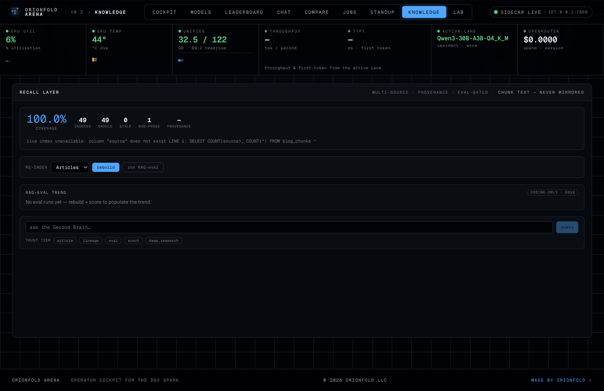
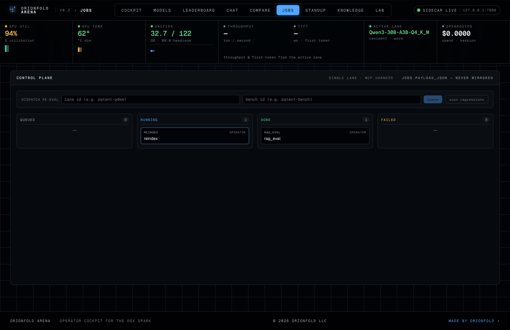
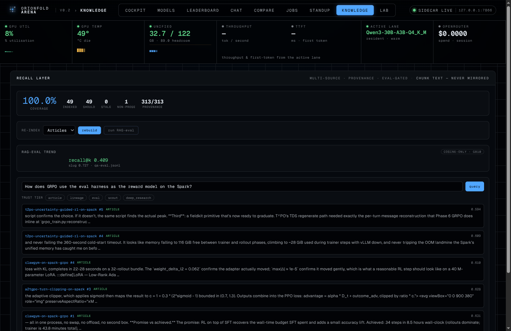
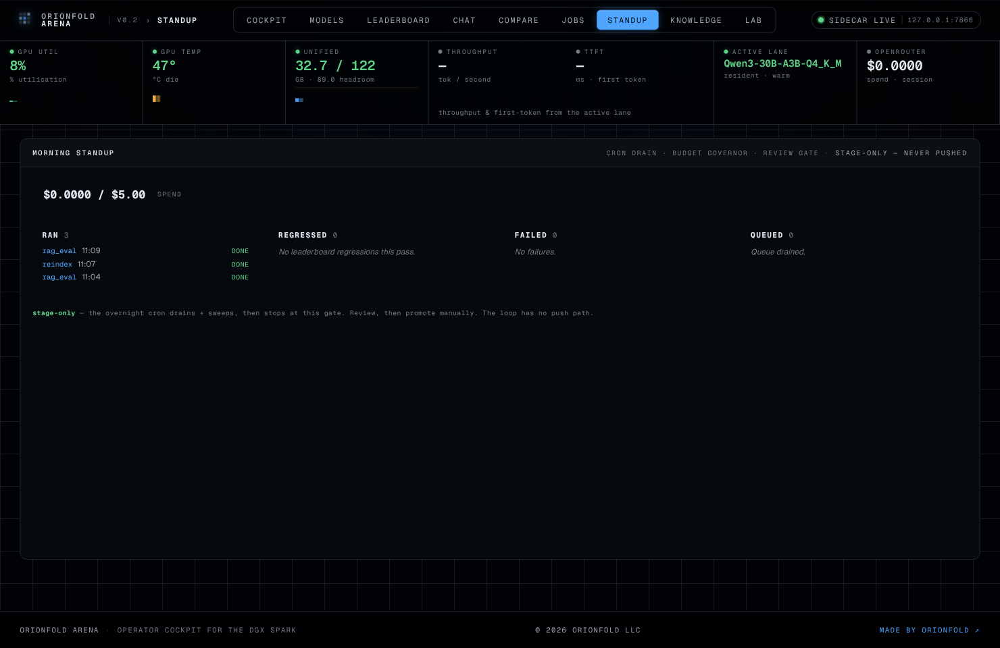

A retrieval index is the easiest thing in an AI stack to let rot. You build it once, it works, and then the corpus grows, the embedder changes, a re-ingest silently drops a tenth of your documents — and nothing tells you. The one number that matters, *does a question still find its answer*, stays invisible until the day it fails you. This piece is about closing that gap on one DGX Spark: a recall layer that re-indexes itself, scores itself against a gold set, and refuses to promote a rebuild that makes retrieval worse — driven not by a script but through the same cockpit and the same dispatcher an agent uses. The sharper finding is what fell out the first time I drove the whole loop end-to-end on the blog's own corpus: a bug that eight unit tests had never tripped, because every one of them mocked the part that was broken.

## Why this matters for a solo builder on one machine

The thesis of this whole body of work is a [continuously-updated world model](/book/) — a system that writes artifacts *and* reads its own past back. The writing half is well-trodden here: notes become articles, articles become Book chapters. The reading half — querying your own corpus, and trusting the answer — is where most local setups quietly fail, because they treat the index as fire-and-forget. For a personal AI power user, the index *is* the memory. If it degrades without telling you, every downstream agent that retrieves from it degrades too, silently. Making recall a measured, gated, operator-visible number is the difference between a Second Brain you can lean on and one you merely hope is still good. And because it all runs on the machine under the desk — pgvector, a local embedder, the gold set — the documents and the queries never leave it.

:::define[Recall@k]
The fraction of gold questions whose correct source is found in the top-`k` retrieved results. Chunk-recall@5 demands the exact `(article, chunk)` land in the top five; slug-recall@5 is the looser test that the right *article* appears. It is the single number that says whether retrieval is still doing its job.
:::

## Architectural context: the loop is the product

The recall layer — shipped as [Orionfold Cortex](/products/orionfold-cortex/) — is a milestone of the [Orionfold Arena](/products/orionfold-arena/) cockpit, the `fieldkit.memory` module plus a knowledge pane — but the architecture that matters here is the *loop*, not the module. A rebuild is not done when it finishes; it is done when it has scored itself and proven it didn't regress. Four stages chain through the control plane: re-index the corpus, score the fresh index against a held-out gold set, gate the result against the prior score, and serve provenance-filtered queries off the index that passed.

<figure class="fn-diagram" aria-label="The recall loop: re-index, score, gate, query — dispatched through the Arena control plane. Re-index re-embeds the corpus and stamps provenance; score computes recall@k against a 44-question gold set; the gate compares against the prior index and refuses to promote a regression; query serves provenance-filtered retrieval. A dashed edge runs the gate's verdict down to a staged morning standup, never an auto-push.">
  <svg viewBox="0 0 900 260" role="img" aria-label="Four-stage pipeline: re-index to score to gate to query. The gate node is the thesis-critical accent. A dashed edge drops from the gate to a ghost standup node, indicating the verdict is staged for human review, never pushed." preserveAspectRatio="xMidYMid meet">
    <defs>
      <linearGradient id="mm-band" x1="0" y1="0" x2="0" y2="1">
        <stop offset="0%" stop-color="var(--svg-accent-blue)" stop-opacity="0.02"/>
        <stop offset="50%" stop-color="var(--svg-accent-blue)" stop-opacity="0.10"/>
        <stop offset="100%" stop-color="var(--svg-accent-blue)" stop-opacity="0.02"/>
      </linearGradient>
    </defs>
    <rect x="60" y="20" width="780" height="220" rx="10" fill="url(#mm-band)" stroke="none"/>
    <g class="fn-diagram__edges">
      <line x1="240" y1="92" x2="280" y2="92"/>
      <line x1="440" y1="92" x2="480" y2="92"/>
      <line x1="640" y1="92" x2="680" y2="92"/>
      <line x1="560" y1="124" x2="560" y2="160" stroke-dasharray="3 3"/>
    </g>
    <g class="fn-diagram__nodes">
      <rect class="fn-diagram__node" x="80" y="60" width="160" height="64" rx="8"/>
      <rect class="fn-diagram__node" x="280" y="60" width="160" height="64" rx="8"/>
      <rect class="fn-diagram__node fn-diagram__node--accent" x="480" y="60" width="160" height="64" rx="8"/>
      <rect class="fn-diagram__node" x="680" y="60" width="160" height="64" rx="8"/>
      <rect class="fn-diagram__node fn-diagram__node--ghost" x="480" y="160" width="160" height="48" rx="8"/>
    </g>
    <g font-family="var(--font-mono)" font-size="11" fill="var(--svg-text-muted)" text-anchor="middle">
      <text x="160" y="88" font-weight="600">RE-INDEX</text>
      <text x="160" y="108" font-size="8" fill="var(--svg-text-faint)">ensure_schema · embed</text>
      <text x="360" y="88" font-weight="600">SCORE</text>
      <text x="360" y="108" font-size="8" fill="var(--svg-text-faint)">rag_eval · recall@k</text>
      <text x="560" y="88" font-weight="700" fill="var(--svg-accent-blue)">GATE</text>
      <text x="560" y="108" font-size="8" fill="var(--svg-text-faint)">promote? vs prior</text>
      <text x="760" y="88" font-weight="600">QUERY</text>
      <text x="760" y="108" font-size="8" fill="var(--svg-text-faint)">provenance · trust tier</text>
      <text x="560" y="184" font-weight="600" fill="var(--svg-text-faint)">STANDUP · STAGED</text>
      <text x="560" y="200" font-size="8" fill="var(--svg-text-faint)">review gate · no push</text>
    </g>
  </svg>
  <figcaption>Every rebuild scores itself and must clear the prior index before it is promoted; the verdict lands in a staged morning standup, never an auto-push. This is the loop the unit tests never ran.</figcaption>
</figure>

The reason the loop matters more than any one stage is that each stage is dispatched, not invoked. Clicking *rebuild* in the cockpit doesn't run a shell script — it enqueues a `reindex` job and a chained `rag_eval` job onto the Arena control plane, which drains them one at a time through the same Model-Context-Protocol harness an agent uses to drive the box. The operator's buttons and the agent's tools are the *same* tools.

:::define[Control plane]
The Arena cockpit's job layer: a queue, a dispatcher, and a sequential drain. Work is enqueued as a job, claimed one at a time (the Spark serves one model lane at a time), and executed through the shared MCP harness — so a re-index a human clicks and a re-index an agent triggers run the identical code path.
:::

:::why[The operator's buttons and the agent's tools are the same tools]
Dispatching every job through one MCP harness means the safety rails and the execution path are defined once. There is no "human path" that drifts from the "agent path" — which is exactly the divergence that lets a bug hide on one side and not the other. Until you run the human path, you haven't tested the agent path either.
:::

## The journey: driving the loop on its own corpus

I brought the cockpit up and opened the knowledge pane against the blog's live pgvector index — 49 published articles, already embedded. The pane was blunt about its own state.



*Coverage reads 100%, but the provenance figure is a dash and a red note runs underneath: `live index unavailable: column "source" does not exist`. The index had documents; it had no idea where any of them came from.*

The provenance columns didn't exist yet. That is the appliance's design working as intended: the schema is additive and the first re-index installs it. So I clicked *rebuild*. Two jobs appeared on the control plane — the re-index, and the RAG-eval chained behind it to score whatever the rebuild produced.



*The board mid-drain. The re-index is running with the GPU pinned at 94% as it re-embeds every chunk; the scoring job sits beside it. Both are tagged `OPERATOR` — this is the human path, exercising the same dispatcher the agent uses.*

:::define[Provenance card]
A per-chunk trust record stamped at ingest — `source`, `kind`, `doc_date`, `verdict`, `link` — so retrieval can filter by where a passage came from. A Spark-*measured* number and an externally-*claimed* one are not interchangeable, and the provenance card is what lets the index tell them apart.
:::

And then the chained RAG-eval **failed**. Not the re-index — that ran clean, installed the provenance columns, and stamped all 313 chunks. The *scoring* job died, and the error was almost insulting in its smallness:

```
rag_eval  failed  error: name 'json' is not defined
```

## The bug the mocks slept through

The scoring tool parses its gold set with `json.loads`. The module had shipped without a top-level `import json` — the single `json.` reference in the whole file, and no import to back it. One line. It had been broken since the recall layer landed, and nothing had caught it.

:::pitfall[A mock runner tests the dispatcher, not the tool]
The `rag_eval` job had eight unit tests. Every one injected a *mock runner* — a stand-in that returns a canned result — to test the dispatcher's enqueue/claim/persist logic. None of them ever executed the real tool body, so the line that referenced `json` without importing it never ran in CI. The tests were green and the feature was broken, simultaneously, for as long as it existed.
:::

This is the whole argument of the piece in one defect. A mock is a promise that the thing it replaces behaves a certain way; it cannot verify that promise. The dispatcher tests proved the *plumbing* was sound — jobs enqueue, claim, persist, and surface their status correctly — and that was genuinely worth proving. But the tool at the end of the pipe had never been pulled through a real drain. The first time an operator clicked a button, the button found the bug in seconds.

:::why[Operating what you built is a test mocks can't be]
Unit tests verify the contracts you thought to write. Driving the real surface verifies the contracts you didn't — the import that isn't there, the column that doesn't exist yet, the empty-state that 503s. The dogfood isn't a nicety on top of the test suite; it covers a category the suite structurally cannot.
:::

The fix was the obvious one line, plus a regression test that does what the eight others didn't — calls the real scoring function with a monkeypatched index and gold set, so the `json.loads` path actually executes without needing live infrastructure. Import added, test added, loop closed.

## Verification: what a scored index looks like

With the fix in, I drove the loop again. This time the re-index ran clean, the chained RAG-eval ran clean, and the pane went from degraded to scored.


*Provenance now reads 313/313 — every chunk stamped. The RAG-eval trend has its first point: chunk-recall@5 of 0.409, slug-recall@5 of 0.727, against the 44-question gold set, over an index of 49 articles and 313 chunks.*

Those are the honest numbers on the cosine-only lane — no reranker in the path, because the GB10 has no reranker profile yet, and the tool *raises* rather than silently mislabel a reranked score as a cosine one. Slug-recall at 0.727 says the right article surfaces in the top five about three times in four; chunk-recall at 0.409 says the *exact* passage does about two times in five. For a single embedding model with no rerank stage and no query rewriting, that's a believable floor and, more importantly, a *tracked* one.

:::math[What recall@5 is really saying]
44 gold questions, top-5 retrieval. slug-recall 0.727 ≈ 32 of 44 questions surface the right article in their top five; chunk-recall 0.409 ≈ 18 of 44 land the exact chunk. The gap between them is the reranker's job — and the bounded drift the appliance is honest about.
:::

Then the point of scoring: the gate. I ran a second RAG-eval against the now-stable index. The first score had no baseline, so it promoted unconditionally; the second compared against the prior 0.409, computed a delta of 0.0, and returned a `promote` verdict. The mechanism that matters is the one that *wouldn't* promote — a rebuild that dropped recall would be flagged, not silently shipped.

:::define[Promotion gate]
The rule that a re-index is only accepted if its recall@k is at least the prior index's, scored like-for-like on the same gold set and the same lane. The first run sets the baseline; every run after defends it. It turns "I rebuilt the index" into "I rebuilt the index and proved it didn't get worse."
:::

Finally, the read surface — the reason the index exists. I asked the Second Brain, through the cockpit, *how does GRPO use the eval harness as the reward model on the Spark?*



*The query console returned cited chunks from exactly the right notes — the GRPO and trajectory-eval pieces — each tagged with its source and trust tier. The chips let you constrain retrieval to the provenance you trust for a given question.*

The whole run closes on the morning standup — the control plane's review surface, showing what ran and whether anything regressed.



*Three jobs ran — a re-index and two scoring runs — zero regressed, spend $0.00 (it all ran local), and the loop stops here: staged for review, never pushed. The autonomy is real; the auto-push is not.*

## Tradeoffs, gotchas, and what's still bounded

The honest edges are worth naming. The recall@5 is a **cosine-only** baseline — no reranker, because there's no GB10 reranker profile yet, so today's number is a floor the rerank stage will lift, not a ceiling. The **generator-side metrics** — faithfulness, answer correctness — are null in this lane; they need a local generator NIM resident, and the Spark serves one model lane at a time. And the index is **single-source today**: the provenance schema spans five classes (article, lineage, eval, scout, deep-research), but only the article class is populated — the others are wired and empty. Folding experiment lineage into the same stamped index, so the Brain recalls not just what I *wrote* but what I *measured*, is the next real step.

:::pitfall[`coverage: 100%` does not mean `provenance: 100%`]
The pane happily reported 100% coverage while the provenance column didn't exist. Coverage answers "are the documents indexed?"; provenance answers "do we know where each chunk came from?" They are different questions, and a healthy-looking coverage number can sit on top of an index that can't tell a measured fact from a claim. Read both.
:::

The deeper gotcha is the one the bug taught: a green test suite is evidence about the contracts you wrote, not about the system. The dispatcher was well-tested and the tool it dispatched was broken, and both statements were true at once. The cheapest, highest-yield test I ran all session was clicking a button.

## What this unlocks

Three things follow directly. First, a **freshness hook**: wire the re-index to fire on publish, and the index can never drift more than one article behind the corpus — the staleness that bites every fire-and-forget RAG becomes structurally impossible. Second, a **gated nightly rebuild**: let the control plane's cron drain a re-index + score overnight, and read the recall delta in the morning standup — an index that defends its own recall while you sleep, and stages a review instead of pushing. Third, **lineage-aware recall**: ingest the experiment trials and eval runs into the same provenance-stamped index, and the Second Brain starts answering "what did I *measure* about this?" with cited, trust-tiered numbers — the read-back half of the world model the whole project is built toward.

:::hardware[The loop is the same; the lane count is the config]
On the Spark the drain is sequential — one model lane at a time inside 128 GB of unified memory, so the re-index and a resident generator can't both be hot. On a multi-GPU node the identical control plane drains the same queue in parallel: reranker lane, generator lane, and embedder resident at once, so chunk-recall and faithfulness get measured in the same pass. The orchestration code doesn't change — concurrency is a configuration, not a rewrite.
:::

:::deeper
- [Orionfold Cortex launch](/products/orionfold-cortex/) — the product this loop ships as, with the measured recall@k on its card.
- [Ragas, Reranked](/field-notes/rag-eval-ragas-and-nemo-evaluator/) — the sibling piece that built the 44-question gold set and showed retrieval is where the points come from.
- [Book Ch. 10 — The World Model](/book/) and [Ch. 11 — The Machine That Builds Machines](/book/) — the world-model thesis this recall layer is the read-back half of.
:::

## Closing

The machine that builds machines has to be a machine that *remembers* — and a memory you can't measure is a memory you can't trust. Driving the recall loop end-to-end on its own corpus did two things a thousand green unit tests hadn't: it put a real, gated recall number on the board, and it found the one line that had been broken since the layer shipped. The lesson generalizes past this one bug. Build the thing, then operate it — because the surface you operate is the only place the truth the suite slept through finally has to show itself. Next, the freshness hook: an index that re-scores itself the moment a new article lands, so the Second Brain is never more than one commit behind the mind it's modeling.
