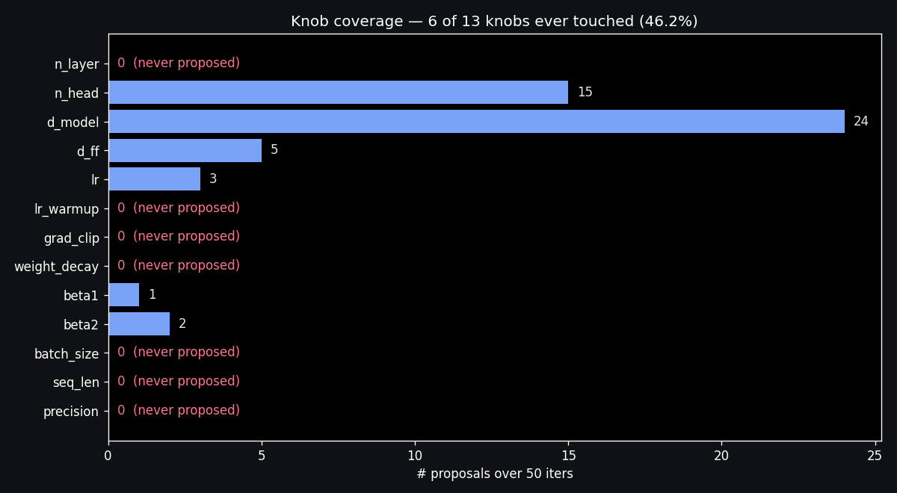
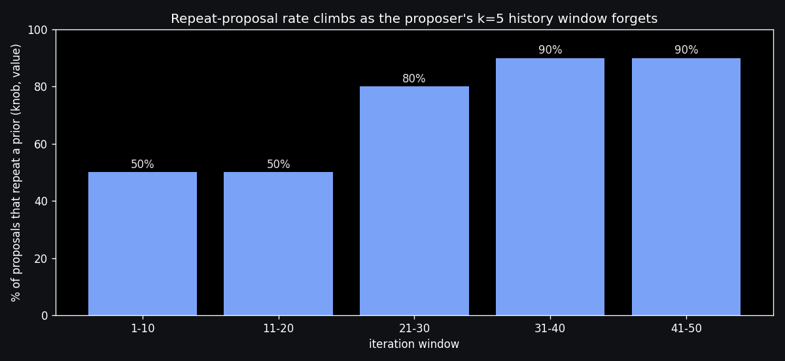
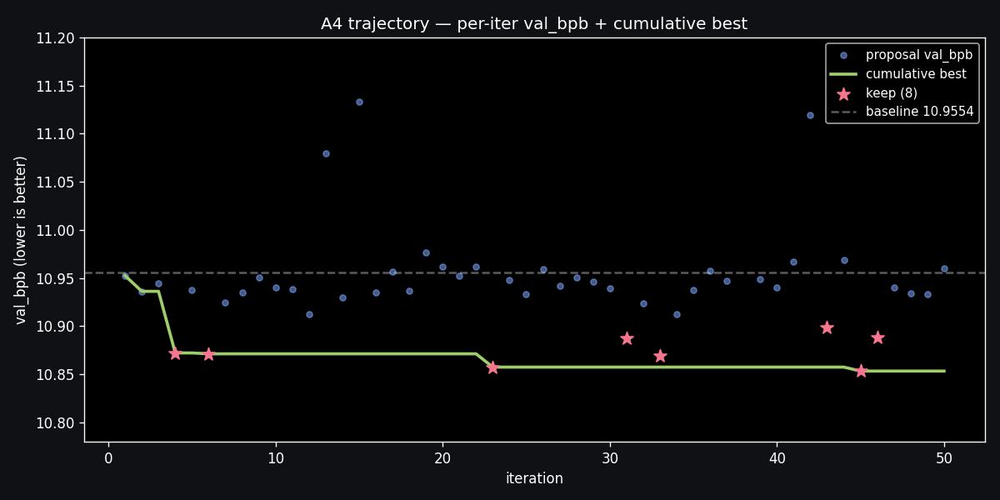

[A8 shipped an honest negative result](/articles/distill-architect-lora-from-trajectories): a Qwen2.5-3B LoRA trained on the [A4 trajectory](/articles/autoresearch-agent-loop) mode-collapsed onto the trajectory's most-frequent winning move — `d_model=768`, suggested verbatim five out of five training-set keeps — and matched 0 of 8 held-out picks. The article's own diagnosis was: *the corpus was thin*. This is the follow-up that puts numbers on what "thin" means and points at the line of code that caused it.

The A4 loop ran for 73 minutes overnight, evaluated 50 perturbations, accepted 8 of them, and lowered val_bpb from 10.9554 to 10.8534 — a real 0.93% improvement that would have made the article shippable on its own. So at the surface, the trajectory looked like a researcher: it explored, it accepted, it improved. The trouble is that a corpus designed for distillation has to be *informative*, not just successful. And by every observability metric, this trajectory was the opposite.

The numbers below come from one Python script — `analyze_trajectory.py` reads the 50-row JSONL and the 13-knob perturbation menu — and produce three figures plus an `analysis.json`. Total wall: ~2 seconds.

| measurement | value |
|---|---:|
| trajectory iterations | 50 (8 keeps, 42 reverts) |
| **knob coverage** | **6 of 13** ever touched · **46.2%** of search space |
| knobs the agent never proposed | n_layer · lr_warmup · grad_clip · weight_decay · batch_size · seq_len · precision |
| **(knob, value) repeat rate** | **36 / 50 = 72%** were proposals already seen |
| unique (knob, value) pairs explored | 14 (out of ≥40 menu-allowed) |
| most-proposed pair | `d_model=1536` (**10×**, all reverted) |
| most-kept pair | `d_model=768` (**6 of 8 keeps** = 75%) |
| repeat rate, iters 1-10 → iters 41-50 | **50% → 90%** (climbs as the proposer forgets) |
| time to first keep | iter 4 (`d_model=768`, `+0.76%`) |
| time to best keep | iter 45 (`d_model=768`, `+0.93%`) — 41 iters of plateau |
| **train split keeps that were `d_model=768`** | **5 of 5** = 100% (the LoRA had only one mode to learn) |
| test split keeps that were `d_model=768` | 1 of 3 (held-out diversity is fine — train split's isn't) |
| script wall to compute all of the above | ~2 s |

The honest one-line summary: *the trajectory wasn't a corpus — it was the same successful proposal copy-pasted six times with 42 misses around it*. A8's distilled student didn't fail because LoRA can't capture the 8B's behaviour; it failed because the only behaviour the training data reinforced was "always say `d_model=768`".

## What flailing looks like in numbers

The 13-knob perturbation menu (defined in [A5's guardrails](/articles/guardrails-for-code-generation)) gave the agent a wide search space: `n_layer`, `n_head`, `d_model`, `d_ff`, `lr`, `lr_warmup`, `grad_clip`, `weight_decay`, `beta1`, `beta2`, `batch_size`, `seq_len`, `precision`. Some are categorical (`precision: bf16/fp8`), some range-bounded (`lr: 1e-5..1e-2`). All thirteen are first-class citizens of the menu — the rails treat them identically.

Across 50 proposals, the agent touched six.



`d_model` alone took 24 of the 50 proposals — nearly half. Combined with `n_head` it took 39 of 50 = 78%. Seven knobs never appeared: not even once across 50 chances. That's not a sampling fluke; even uniform random over 13 knobs would have hit every knob by iter 50 with overwhelming probability. The proposer is biased toward *capacity-dimension* knobs (`d_model`, `n_head`, `d_ff`) and ignores *optimization-dimension* knobs (`lr_warmup`, `grad_clip`, `weight_decay`, `batch_size`, `seq_len`, `precision`).

Why does this matter for distillation? The corpus the LoRA learned from has zero examples of "what to do when the optimizer is too aggressive" or "what to do when sequence length is wrong." Whatever the agent learned about the optimization-dim subspace is unrepresented. The student couldn't have learned it even if the teacher had been consistent.

## The repeat rate climbs because the proposer forgets

A worse problem hides inside the 50 proposals: 36 of them were *literal repeats* of a (knob, value) pair the agent had already proposed. The unique-pair count across the run is 14. So the agent proposed `d_model=1536` ten times across the run, `n_head=32` six times, `d_model=768` seven times — most of those after the first instance had already been evaluated and the result logged.

Why? `articles/autoresearch-agent-loop/evidence/proposer.py` builds the prompt with this line:

```python
def _history_lines(history: list[dict], k: int = 5) -> str:
    if not history:
        return "(no prior iterations yet)"
    recent = history[-k:]
    ...
```

The agent's prompt only shows the **last 5 iterations**. The system prompt warns "DO NOT propose the same knob and value as the last accepted state" — and the agent obeys *that* literally: the most recent acceptance is rarely re-proposed. But the prompt has no view of iterations 1 through 25 by the time iter 30 fires. Whatever the loop learned then is gone.

The repeat rate makes the cost of this design choice visible:



In the first 10 iterations, half of the proposals were already-seen pairs — already a sign the proposer was leaning on a few favorites. By iter 21-30, that's 80%. By iter 31-50, it's 90%. *Nine out of ten proposals in the second half of the run were ground the agent had already covered.* The 73-minute wall did not get the loop nine-tenths of a richer corpus; it got it the same ~14 ideas re-litigated with diminishing utility.

This is a **prompt design bug, not a model bug**. The 8B is a competent proposer when it can see what it has tried — the first 10 iterations are evidence of that. After the rolling window slides past iter 5, it's proposing into an amnesiac context.

## The plateau — first keep and best keep are the same idea

The cumulative best curve over 50 iters tells the same story from a different angle.



The agent finds `d_model=768` at iter 4 (`+0.76%`) and confirms it at iter 6 (`+0.77%`). Then nothing happens for **17 iterations**. Iter 23 is another `d_model=768` keep with marginally better val_bpb (`+0.89%`). More small `d_model=768` keeps at iters 31, 33, 43, 45, 46. The "best" iter 45 is `+0.93%` — a 0.04 percentage-point improvement over what the agent already knew at iter 6.

Eight keeps is genuinely a respectable yield for a free overnight loop. But six of those eight keeps proposed *the same single change*. From an exploration perspective, this loop did its useful work in the first ~6 iterations and the next ~44 were variations on the theme. From a distillation-corpus perspective, this is much worse than it looks: the keep-side mode dominance is even higher than the proposal-side mode dominance.

## Why this killed the LoRA

A8's `prepare_corpus.py` used a **time-tail split**: iters 1–42 became train, iters 43–50 became held-out test. Both decisions (keep + revert) are training rows, but the keeps are what the LoRA has the strongest signal to imitate — they're the proposals that worked.

Across the 8 keeps in the trajectory:

| split | keep iters | mode breakdown |
|---|---|---|
| train (iters 1–42) | 5 keeps: 4, 6, 23, 31, 33 | **5 of 5 = `d_model=768`** |
| test (iters 43–50) | 3 keeps: 43, 45, 46 | 1× `d_model=768` · 1× `d_ff=6144` · 1× `d_ff=8192` |

The train split is *literally a single-mode distribution*. Every successful example the LoRA was supervised on said the same thing. Cross-entropy loss on five copies of `{"knob": "d_model", "new_value": 768, "reason": "..."}` reinforces exactly one output sequence. With `r=16` LoRA adapters and 30 optimizer steps, that signal isn't competing with much else.

The held-out 3 keeps are diverse — they touch a *different* knob (`d_ff`) the model barely saw in training. So at race time, the 3B distilled student saw 8 prompts that, on average, asked for a knob it had no positive examples of, and answered with the only thing it had been trained to be confident about. 0 of 8 exact match was the predictable outcome.

The 8B teacher fared better on the same 8 prompts (4 of 8 exact, 0.5 mean reciprocal-rank in spirit if not in name) for an obvious reason: the 8B's distribution wasn't filtered through 5-of-5 mode collapse. It still has the broad world knowledge that says "if `d_model=768` keeps winning, maybe try `d_ff` next." The LoRA stripped that prior out.

## Three cheap fixes for A4.2

The 200-iter overnight rerun queued in the next session has to land *one* of these to be worth the wall time.

**1. Rail-side anti-repeat (cleanest).** [A5's guardrails](/articles/guardrails-for-code-generation) already maintain `seen_pairs` semantics conceptually. Adding a `block_repeat` rail that rejects any (knob, value) seen in the last 50 iterations forces the agent to propose elsewhere on retry. The proposer doesn't change — the rails just refuse to evaluate ground already covered. Cost: a one-line check in `gate()`.

**2. Prompt-side widening (most informative for distillation).** Bump `k` from 5 to 30 (or all-history). The proposer's prompt grows from ~6 lines of recent history to ~30+. The 8B sees what it tried, what worked, what failed; it can reason "I already tried `d_model=1536` six times and reverted every time, let me try `lr_warmup` for a change." Cost: longer prompt (~10× tokens for the history block), proportionally slower per-iter NIM call (was 1.23 s mean — would become maybe 2-3 s), but the corpus quality goes up dramatically.

**3. Reason-temperature bump.** A lazier fix: serve the 8B with `temperature=0.8` instead of whatever default the NIM uses. The agent will be less prone to falling into the local mode. Cheapest to implement, but doesn't fix the structural problem; just papers over it.

The honest recommendation is **(1) plus (2)**: rails reject duplicates, prompt shows the full history. Then 200 iters produces 200 unique evaluated configs, and the corpus distillation can learn from is roughly 14× richer than what A4 produced. With 200 train rows of diverse keeps and reverts, A8's rematch becomes a real test of whether a 3B can imitate an 8B at this task — instead of a test of whether 3B can mode-collapse onto a single training example, which we already know it can.

## What this means for the agent loop

The A4 article's headline was *"the agent ran 50 experiments overnight on a Spark and the box stayed up."* Both are still true. What this observability pass adds is the qualifier: the agent ran 50 experiments, but only ~14 of them were genuinely new experiments — the rest were the agent's k=5 rolling window failing to teach it that it had already covered the same ground.

That's a useful thing to know about LLM-driven loops in general. Agents with bounded prompt history are biased toward whatever mode the rolling window happens to anchor on. They look like they're exploring because the loop counter increments. They're not. The loop counter and the search-space coverage are two different things, and only one of them shows up in a status dashboard.

The fix is observability that runs continuously, not retrospectively. A4.2 should land **`agent_loop.py` writing per-iter knob-coverage and pair-repeat numbers to a sidecar JSON** so the next time someone watches the overnight run progress, they're watching exploration, not iteration count. The Spark substrate was free; the corpus quality is what determined whether downstream work could use it. Measuring corpus quality cheaply, while the loop is still running, makes the next overnight worth running.

## State of the apps

The Autoresearch arc now has nine pieces: A4 (the loop), A5 (the rails), A6 (the rerank we never finished), A7 (the curator pre-prep), A8 (the LoRA distillation), A8.2 implied (the rematch, blocked on more corpus), and now A9 (this observability pass). The remaining open work is A4.2 — the 200-iter rerun with anti-repeat and (ideally) widened prompt history. After that runs, the A8 rematch becomes the next natural article: same recipe, the corpus distillation actually had a chance to learn from.

Other arcs unchanged. Second Brain is at four articles, LLM Wiki opener still queued, Looking Beyond Spark at three.
