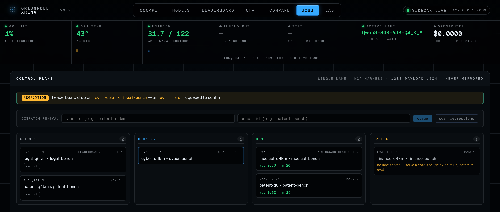
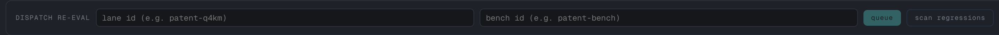
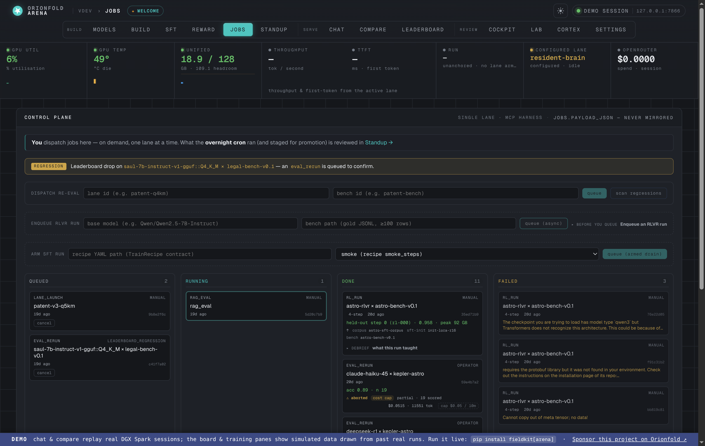
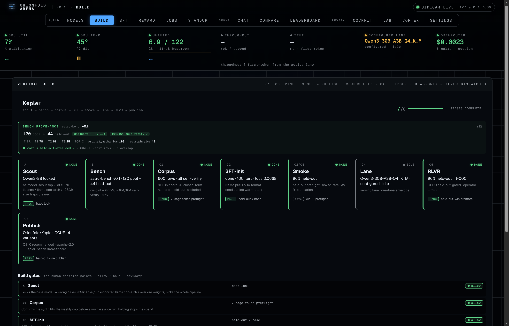
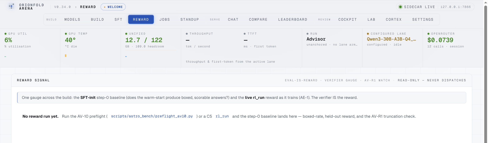
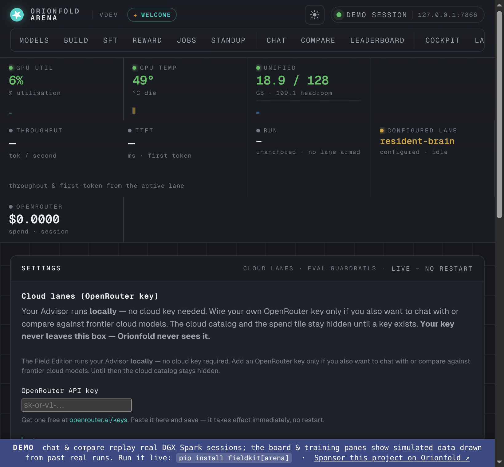
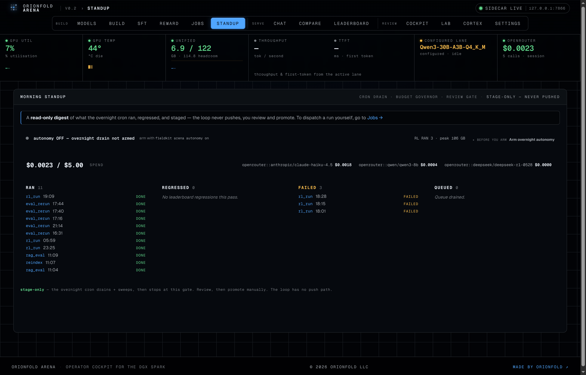

## A cockpit that dispatches, not just records

**The Arena control plane is the jobs board that lets one operator trigger
model work from a single screen on a DGX Spark — re-evaluate a model against the
exact bench it was scored on, watch the leaderboard for regressions, and have a
confirming re-eval queue itself the moment a score slips.** It is a new surface
inside [Orionfold Arena](/products/orionfold-arena/), the local-LLM cockpit, and
it changes what the cockpit *is*.

Until now the Arena was a recorder: it watched lanes run, captured chats and
compares, and published a leak-proof leaderboard over your own results. The
control plane promotes it to a *dispatcher* — the place you start work from, not
just the place you read it back. If you fine-tune, quantize, and publish models
on a Spark and you want a control room that not only shows you a regression but
acts on it, this is that room. Everything still runs on the machine under your
desk, and the job payloads — the lanes and benches and prompts a job operates on
— never leave it.

## What it unlocks

A leaderboard tells you a number moved. A control plane lets you do something
about it without leaving the page. That is the whole shift: the loop between
*noticing a regression* and *confirming it* closes inside the cockpit, on the
same hardware that produced the numbers in the first place.

For a researcher, that turns evaluation from a chore you remember to run into a
property the cockpit maintains. Ship a new quantization, and a single "scan
regressions" diffs the live accuracy leaderboard against its last baseline; any
score that dropped past a threshold enqueues a confirming re-evaluation
automatically, so a real regression separates itself from eval noise before you
have to think about it. You can also reach for the board deliberately — re-score
a specific lane against a specific bench when you've changed something and want
the number refreshed — and watch it move through *queued → running → done* with
the measured accuracy on the card when it lands.

For a Spark operator, it is one board over work that used to live in a dozen
terminal invocations. The Arena drains one job at a time, one lane resident,
because GPU and system memory share the same 128 GB pool — so the control plane
respects the envelope by construction rather than asking you to. And every job is
dispatched through the *same* MCP harness the autonomous agent uses, which means
the safety rails are defined once: the tool list the dispatcher can reach is the
policy, and a job can only ever call the read-and-measure tools on it.

## How it got built — a sprint over a substrate that already existed

The control plane was specified, built, fixed, and shipped in a single focused
sprint of about **two and a half hours** on one afternoon. That number is the
whole point of the build story, and it is honest precisely because almost none of
the milestone was greenfield.

The pieces a dispatcher needs were already on the machine. The execution surface
— the MCP harness that the [agent already drives the Spark
through](/field-notes/hermes-drives-the-spark-via-fieldkit-mcp/) with zero
tool-call format errors — existed. The scoring path it calls — the bench loader,
the deterministic and judge-based scorers, the per-question score table, the
accuracy rollup behind the leaderboard — existed. Even the socket the queue
plugs into (a dormant per-run status row) had been drilled in an earlier
milestone and was waiting to be activated. The control plane is, in the spec's
own words, *connective tissue, not greenfield*: the work was wiring a queue and a
board onto surfaces that were already load-bearing.

So the sprint added a job dispatcher module, a schema migration for the
`jobs` and `job_triggers` tables, four REST endpoints with a server-sent-events
feed, a leaderboard-regression detector and its producer, two new harness tools
the dispatcher calls, and a Preact board to drive it all — then a follow-up pass
that wired the re-eval's bench resolution and the regression producer end to end
after a live walk-through surfaced the two gaps between *built* and
*demonstrable*. The milestone shipped inside `fieldkit` v0.16.0, the first
packaged Arena release.

> **The build, measured.** ~2.6 hours of wall-clock across one afternoon — six
> commits from the spec lock to the v0.16.0 release; **1,762 lines of authored
> source** (the dispatcher, the API and its SSE stream, the schema migration, the
> regression detector, the two harness tools, and the cockpit board, with the
> ~630 lines of new tests counted separately); **35 tests for the dispatcher and
> its API**, part of a 37-case M8 set that also planted a payload-leak sentinel
> and reshaped the harness suite to the nine-tool surface. The agentic effort
> behind it: 2 Claude Code sessions, 107 assistant turns, **18.6M tokens
> processed of which 95.9% were served from the prompt cache**, and only 104k
> tokens actually generated. It was built **entirely on Claude Opus 4.8** — the
> same model that now drives the daily work, so there is no model handoff in this
> one, just a single driver moving a spec to a shipped release in an afternoon.

*The build-metrics infographic is rendered by the site from the mined `build:`
block; every figure traces back to `assets/build-metrics.json`.*

The cache ratio is the quiet reason a milestone like this lands in hours rather
than days: at ~96% cache hits the model holds the entire arena codebase — store,
server, mirror, harness, the spec — in working context and spends fresh tokens
only on the new wiring, not on re-reading what it already knows.

## The feature tour

The control plane is one route — `/arena/jobs/` — so the tour is the anatomy of a
single board: what it shows, how you trigger work, and what each card tells you.

### The control plane board

*One screen: the live telemetry rail, a regression banner, the dispatch form,
and the four-column board of every re-evaluation the Spark is working through.*

The board is the cockpit's new home for work-in-flight. The same instrument rail
that fronts every Arena page sits across the top — GPU utilization, die
temperature, the unified-memory envelope with its headroom, and the resident lane
(here the discovered Kepler Q8 GGUF, live on its port) — so you watch the machine's
state while the queue
drains. Below it, four columns track each job from *queued* through *running* to
*done* or *failed*. The header line states the two invariants that make this safe
to leave running: **single lane** (one model resident at a time, inside the
128 GB pool) and **MCP harness** (every job executes through the curated tool
surface), with the reminder that `jobs.payload_json` is never mirrored.

### Dispatch a re-eval, or scan for regressions

*Queue a re-eval by hand, or let the regression detector do it — the banner fires
when a leaderboard drop has auto-enqueued a confirming re-evaluation.*

This is where the cockpit stops being passive. Type a lane and a bench and **queue**
a re-evaluation directly; the dispatcher claims it, runs it through the harness on
the resident lane, and folds the result back into the leaderboard. Or press
**scan regressions** and the detector diffs the live accuracy leaderboard against
its stored baseline — the first scan just sets that baseline, and every scan after
it auto-queues a confirming `eval_rerun` for any score that has slipped past the
threshold. When it does, the **regression banner** surfaces it in plain language —
*"Leaderboard drop on `legal-q5km × legal-bench` — an `eval_rerun` is queued to
confirm"* — so a real drop announces itself and a cheap re-measure decides whether
it was signal or noise before anything downstream reacts. A unique-key gate
coalesces duplicate triggers so a noisy bench can never start a re-eval storm.

### Every job, every state, every result

*Each card carries its kind and trigger; done cards show measured accuracy and the
number of questions scored; a failed card says exactly why.*

The card is the whole story at a glance. Every job names its **kind**
(`eval_rerun`) and what **triggered** it — `manual`, `leaderboard_regression`, or
`stale_bench` — so you always know whether you asked for this work or the cockpit
did. A job still waiting carries a **cancel** button. A **done** card shows the
measured accuracy and how many questions were scored (`acc 0.82 · n 25`). A
**failed** card carries the reason inline — here, the honest day-one state when no
chat lane is served — so the board diagnoses itself rather than sending you to a
log. Because the jobs table is on the never-mirror list, this board exists only
against a live sidecar; the public mirror renders a "cockpit offline" state by
construction, because the work — and the prompts inside it — is yours alone.

## Built on the substrate

The reason a control plane shipped in an afternoon is that it is a thin layer
over `fieldkit`, the toolkit the whole Arena rides on. The milestone named its
modules and wired into them rather than rebuilding them:

- **`fieldkit.arena`** gained the dispatcher itself — the `jobs` module with the
  enqueue/claim/drain loop, the regression detector and its producer, the schema
  migration, and the REST-plus-SSE surface — packaged so the board ships inside
  the wheel and runs from one command.
- **`fieldkit.harness`** is the execution surface every job runs through. The
  milestone added two tools to it *by demand* — one to re-evaluate a lane against
  a bench, one to measure a manifest's variants — its first wiring of the eval
  layer into the harness, so the dispatcher and the autonomous agent share one
  set of rails.
- **`fieldkit.eval`** is the scoring path the re-eval calls: the bench loader,
  the deterministic and judge scorers, and the accuracy rollup the regression
  detector diffs. The control plane gave that machinery a trigger; it didn't
  reinvent it.
- **`fieldkit.nim`** and the local-serving patterns are what a job re-measures
  against when a lane is served — and the reason a job *fails honestly* with
  "no lane served" rather than guessing when one isn't.

The leverage is the story. The dispatcher diffs a leaderboard that was already
being rebuilt from real runs, re-scores against benches the models were already
measured on, and executes through a harness an agent was already driving safely.
The control plane is the assembly of that compounding work into a surface you can
press a button on — not a fresh start.

## The workflow, generalized

Step back and the method is the takeaway. A solo operator on a single DGX Spark,
driving Claude Opus 4.8 through the Claude Code harness over a toolkit that keeps
maturing, took a control-plane milestone from a written spec to a shipped,
tested, released surface in a single afternoon. The speed came from leverage at
every layer: a package that already did the hard parts, a year of measured data
to act on, and a harness whose ~96% cache-hit rate let the model hold the entire
codebase in context and spend fresh tokens only on the new wiring.

It also came from closing the loop between *built* and *demonstrable* in the same
session — a live walk-through of the board surfaced two gaps (the re-eval's bench
resolution and the regression producer weren't wired end to end), and both were
fixed and re-tested before the milestone was called done. That is the repeatable
shape: spec the surface, build it over what exists, drive it live, fix what the
walk-through reveals, ship. Point it at your own shelf of models and your own
Spark and the same loop applies.

## What the board grew into

The launch promised that later phases would extend *this* jobs table rather than
invent their own queue. They did. The surfaces below shipped in the weeks after
the sprint — each one another kind of work flowing through the same dispatcher,
the same single-lane envelope, the same harness rails.

*The dispatch row grew from one job kind to three: re-eval a lane, smoke-test a
base model fine-tune, or launch a training run from a recipe contract — all
draining through the same four columns.*

The board's biggest growth is what it can start. Alongside the original
lane-times-bench re-eval, the dispatch row gained a **fine-tune smoke** slot — a
base model plus a small gold bench, capped at twenty rows, to answer "is this
base worth training?" before any long run — and a **training run** slot that
takes a recipe file (the `TrainRecipe` contract) and launches it as a job. The
banner above the form states the division of labor plainly: you dispatch here,
on demand, one lane at a time; what the overnight cron ran is reviewed in
Standup.

*A whole vertical build as one spine: each stage card carries its receipts, and
the bench-provenance strip pins exactly which frozen bench scored what.*

When those training jobs belong to a vertical — a domain model being scouted,
benched, corpus-fed, fine-tuned, and RL-polished — the **Build** pane assembles
them into a spine. Each stage is a card with its own receipts; the strip above
pins bench provenance so a score is never separable from the frozen bench that
produced it. This is the machine-that-builds-machines view: the board dispatches
the stages, the spine shows the build they add up to.

*Eval-is-reward, made visible: the same bench verifier that scores the
leaderboard is the reward signal the training run optimizes — one gauge watches
both.*

The **Reward** pane closes the conceptual loop the launch article only gestured
at. The bench verifier *is* the reward: the gauge shows the SFT warm-start's
step-zero baseline (does it produce boxed, scorable answers at all?) and then
the live reward as an RL run trains, with a gate that holds promotion until the
signal is clean. The pane is read-only by design — it watches, it never
dispatches.

*Bounds on metered work: a cost cap and a stall window arm themselves at
dispatch — born from a real cloud eval that once hung for hours accruing
uncapped spend.*

Dispatching cloud comparisons earned the board **guardrails**. A per-run cost
cap and a stall timeout now arm at dispatch time as an immutable snapshot on the
job — the fix for a real OpenRouter eval that once hung for two and a half hours
holding the lane and accruing uncapped spend. Local Spark lanes run unguarded
and unaffected; the bounds exist exactly where the meter does.

*The overnight loop's report card: ran, regressed, failed, queued, and spend —
the cron drains and stages, then stops at this gate for the operator to review
and promote.*

And the promised cron layer landed as **Standup** — a read-only morning digest
of what the overnight drain ran, regressed, and staged. The loop is
*stage-only*: it sweeps the queue, runs the work, and stops at this gate. It has
no push path; you review, then promote. Eleven jobs, zero regressions, three
honest failures, five cents of spend against a five-dollar governor — that is
what delegated overnight work looks like when the board doing it was built to be
left running.

## Get it

The control plane ships inside `fieldkit` — it arrived in v0.16.0, the first
packaged Arena release, and every surface above extends the same install: start
the sidecar and open `/arena/jobs/` to dispatch re-evaluations, scan for
regressions, and watch the board drain. A live web preview of the Arena runs at
[`/arena/demo/`](/arena/demo/). The roadmap the launch sketched — a cron layer
draining the queue overnight, training jobs flowing their results back to the
leaderboard — is the section you just read, landed on the same jobs table it
promised to extend. Bring your own models and your own benches; the control
plane is waiting to dispatch them.
