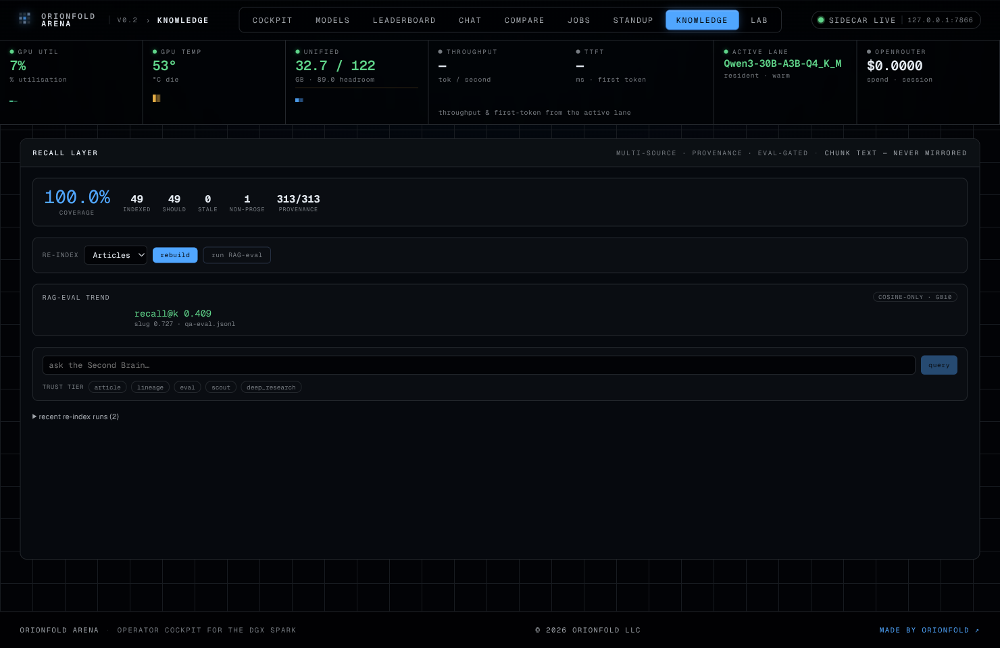

## A recall layer you operate, not a black box

The **Local-Knowledge Appliance** is the memory of the [Orionfold Arena](/products/orionfold-arena/) cockpit, turned into something you can drive. It indexes a corpus on your own NVIDIA DGX Spark — articles, experiment lineage, scouted research — stamps every chunk with its provenance, scores how well the index actually retrieves against a gold set of questions, and refuses to promote a rebuild that would make retrieval worse. It runs entirely on the machine under your desk, and the documents, the chunks, and the queries never leave it.

It is for the Spark operator who has built up a body of work — notes, evals, model cards, research — and wants a *local* retrieval layer they can trust and inspect, rather than a hosted RAG that asks you to take recall on faith. The appliance's whole posture is in one line: **it gates its own recall.** A re-index is not done when it finishes; it is done when it has scored itself and proven it didn't regress.

## What it unlocks

A retrieval index is the easiest thing in an AI stack to let rot. You build it once, it works, and then the corpus grows, the embedder changes, a re-ingest silently drops a tenth of your documents — and nothing tells you. The number that matters (does a question still find its answer?) is invisible until the day it fails you. This appliance makes that number a first-class, charted, gated fact on one screen.

For a researcher running experiments on a Spark, that changes the loop. You can re-index the moment you publish a note and *see* whether recall held; you can ask your own corpus a question and get cited, trust-tagged passages back in under a second; you can let an overnight job refresh the index and read a morning standup that tells you exactly what ran and whether anything regressed. The corpus becomes a live instrument you query and maintain, not an artifact you hope is still good. And because provenance is stamped per chunk, you can ask the index to prefer a *Spark-measured* number over an *externally-claimed* one — a distinction a generic RAG can't honestly make.

## The build story: a layer that learned to grade itself

The recall layer shipped as **Arena milestone M10** — `fieldkit.memory` plus the `/arena/knowledge/` cockpit pane, **1,013 lines** of Python and a Preact island, with the module's own **8-case** test suite. That was the engineering. What this launch documents is the *other* half: the session that drove it end-to-end on this repo's own corpus, measured it for the first time against real questions, and — as dogfooding always does — found something broken.

Driving the appliance through the cockpit is the entire build story here, and the infographic above is that session's honest receipt: **one ~4-hour session, 146 assistant turns, 33.2M tokens processed of which 97.3% were served from Claude Code's prompt cache, and just 133k tokens actually generated** — all on **Claude Opus 4.8**, through the Claude Code harness. The 33-million-token figure is a measure of how much *context* the agent worked over, not how much it wrote; the cache ratio is why an agentic session at that scale is affordable at all.

The dogfood earned its keep immediately. The first real re-index ran clean, but the chained RAG-eval **failed** — `NameError: name 'json' is not defined`. The scoring tool parsed its gold set with `json.loads` but the module had shipped without a `json` import; the unit tests that exercised the job dispatcher all used a mock runner, so the *real* tool body had never executed in a test. One line of import, one infra-free regression test, and the loop closed. That is the case for driving the thing you built through its own UI: a bug invisible to the test suite is obvious the first time an operator clicks the button.

With the fix in, the appliance scored itself for the first time: against a **44-question** in-repo gold set, over an index of **49 articles / 313 chunks**, it returned **chunk-recall@5 of 0.4091** and **slug-recall@5 of 0.7273** on the cosine-only lane — the honest GB10 baseline, with no reranker in the path. Those are the numbers on its catalog card, byte-matched to the run that produced them.

## The feature tour

### Coverage and freshness as a number, not a guess

The top of the pane is the appliance's dashboard: coverage percent, how many documents are indexed versus how many *should* be, how many are stale, and — the field that didn't exist before this session — what fraction of chunks carry a provenance stamp. After the rebuild it reads **100% coverage, 313/313 provenance**. Before the rebuild it read a blunt warning: `live index unavailable: column "source" does not exist`. The appliance bootstrapped its own provenance schema on the first re-index, and the pane went from degraded to green without a single manual SQL statement.

### Re-index from the control plane

Clicking **rebuild** doesn't run a script — it enqueues a `reindex` job and a chained `rag_eval` job onto the Arena control plane, which drains them one at a time through the same MCP harness the agent uses to drive the box. The board shows the work moving: the re-index running with the GPU at **94%** as it re-embeds every chunk, the scoring job already done beside it. The job payloads stay on the machine; only aggregate scores are ever mirrored.

### A recall gate that won't let a rebuild regress

The point of scoring is the gate. Each `rag_eval` compares its recall against the prior run on the same gold set, like-for-like, and records whether it improved. The first score has no baseline, so it promotes unconditionally; the second — run here against the stable index — compared against the prior **0.4091** and reported a delta of **0.0** and a `promote` verdict. The mechanism that matters is the one that *won't* promote: a rebuild that drops recall is flagged instead of silently shipped.

### A provenance-filtered query console

The query console is the appliance's read surface. Asked *"how does GRPO use the eval harness as the reward model on the Spark?"*, it returned cited chunks from exactly the right notes — the GRPO and trajectory-eval pieces — each tagged with its source and trust tier. The trust-tier chips let you constrain retrieval to the provenance you trust for a given question, which is the differentiator a hosted RAG over someone else's corpus structurally can't offer.

## Built on the substrate

The appliance is a thin, honest surface over work that already existed. **`fieldkit.memory`** owns the canonical pgvector index, the provenance schema, and the coverage report. The **`fieldkit.arena` control plane** supplies the jobs board, the dispatcher, and the sequential drain. **`fieldkit.harness`** is the MCP surface the dispatcher executes through — the same one the agent uses — so the re-index and scoring tools are defined once and never diverge. And the recall score rides the same evaluation machinery the rest of the stack uses, against the in-repo `qa-eval` gold set that an [earlier RAG-evaluation deep-dive](/field-notes/rag-eval-ragas-and-nemo-evaluator/) built and version-controlled.

This is the leverage the cockpit was built for. The retrieval stack — pgvector, the local NIM embedder, the gold set — was already measured across a year of field notes. The control plane already knew how to dispatch and drain a job. The appliance is what you get when you point those at each other and add the one thing missing: a layer that *grades its own memory* and won't quietly degrade it.

## The workflow, generalized

The repeatable method underneath this launch is the one the whole machine is built around: a solo operator on one Spark, driving Opus 4.8 through Claude Code over a maturing toolkit, turns an idea into a measured, operable surface — and then *drives it through its own UI* to find what the tests missed. The 97% cache ratio is what makes that affordable; the MCP harness is what keeps the operator's buttons and the agent's tools the same buttons; the gold set is what makes "better" a number instead of a feeling. The bug this session caught is the argument in miniature: build it, then operate it, and let the operating surface the truth the unit tests slept through.

## Get it

The appliance ships inside `fieldkit[arena]` — `pip install "fieldkit[arena]"`, point it at a corpus, and `fieldkit arena up` brings the cockpit and its recall layer up on `127.0.0.1:7866`. The [artifact card](/artifacts/harnesses/local-knowledge-appliance/) carries the measured recall@k and the bounded known-drift the layer is honest about: it is a cosine-only baseline today (no GB10 reranker yet), the generator-side faithfulness metrics wait on a local generator NIM, and only the article source-class is populated so far — lineage, eval, and scout ingest are wired but empty. What's next is closing those bounds: a reranker lane when a GB10 profile lands, and folding experiment lineage into the same provenance-stamped index, so the appliance recalls not just what you *wrote* but what you *measured*.
