## A cockpit for the models on your own machine

**Orionfold Arena is a single-screen cockpit for running, comparing, and
scoring local language models on one NVIDIA DGX Spark.** Open it and you see the
GPU's live telemetry, every model you've published, the benches those models
were measured on, and a leaderboard built from your own results — all on the
machine under your desk, none of it leaving it.

It is for the solo builder who has accumulated a shelf of local models and
nowhere to drive them from. If you fine-tune, quantize, and publish models on a
Spark — or you simply keep a few good GGUFs warm and want to know which one to
reach for — the Arena is the instrument panel that turns that shelf into
something you can fly. Chat against the warm model, set two of them duelling,
score an answer against a gold reference, and read the efficiency frontier to
decide which quant earns its place. Everything is local-first and private by
construction.

## What it unlocks

The thing a Spark gives you that a hosted endpoint never will is a *closed
loop*: the model, its evaluation data, the hardware it runs on, and the results
all live in one place you control. The Arena is what happens when you put a
cockpit over that loop.

For a researcher, that changes the tempo of the work. You can ask a real
question — *does the 8-bit quant of this reasoning model hold its accuracy, and
what does it cost me in tok/s?* — and answer it in the time it takes to load two
lanes and read a chart, instead of standing up a harness and a spreadsheet. The
efficiency frontier is a decision surface, not a vanity metric: it plots quality
against throughput and marks the Pareto skyline, so "which model do I ship"
becomes a place you point at rather than an argument you have. Because the
reference benches travel with the models, you can re-score an answer against gold
the moment it streams in — the eval is one drawer away from the chat, not a
separate pipeline.

For a Spark operator, it is the difference between a directory of `.gguf` files
and a control room. You watch the unified-memory envelope while a model runs,
swap the on-demand local lane without disturbing the resident brain, and reach
any surface with a keystroke. Nothing you type is uploaded; nothing you compare
phones home unless you explicitly pick a hosted lane. The whole thing is a tool
you could run on a plane.

## The build story: one itch, one day

The itch was concrete. By late May I had published a shelf of artifacts under
the Orionfold handle — a reasoning patent strategist, a legal model, a cyber
model, a medical model, a finance chat model — and written more than fifty
field-notes articles full of measured numbers. What I did *not* have was a single
place to run them. Picking a model meant remembering a `llama-server`
invocation; comparing two meant a terminal and a notebook; knowing which quant
was the good one meant re-reading an article I'd written weeks earlier.

The first slice was unglamorous on purpose: a milestone-one skeleton with a spec
and a bare leaderboard table dropped into the editorial site's reading layout. It
looked, in my own note at the time, like crap. But it proved the data path — the
benches, the runs, and the artifact manifests could all be read into one page.
From there the leap to a real product happened fast, because each new surface was
a thin shell over work that already existed: telemetry over the Spark's own
counters, a leaderboard over a leak-proof mirror, chat and compare over the
resident model, an eval drawer over the vertical benches the models were already
scored on.

A day and an overnight later it was fourteen surfaces with its own flight-deck
chrome, a live sidecar, and 125 tests. The numbers below are mined from the build
itself — the git history, the source tree, and the Claude Code session
transcripts — not estimated. They are the evidence for the "production tool in a
day" claim, and the honest version is more interesting than a round one.

> **The build, measured.** ~15.4 hours of wall-clock across one day and an
> overnight (thirteen commits, first to last); 12,733 lines of authored source —
> a Python sidecar (6,999), Preact islands (3,768), Astro pages (1,576), and JS
> libraries (390) — with built bundles excluded; 125 tests written alongside the
> features. The agentic effort behind it: 12 Claude Code sessions, 1,130
> assistant turns, **233.2M tokens processed of which 228.1M (97.8%) were served
> from the prompt cache**, and only 972k tokens actually generated. It was built
> **100% on Claude Opus 4.7**; Opus 4.8 is the daily driver now. That ~98% cache
> ratio is the quiet reason agentic coding at this scale stays affordable — the
> model re-reads an enormous working context cheaply and spends fresh tokens only
> on the new work.

*The build-metrics infographic is rendered by the site from the mined `build:`
block; every figure traces back to `assets/build-metrics.json`.*

Then it kept evolving. The infographic above is the launch snapshot — but the
cockpit you see in the tour below is several sessions further on, every one of
them driven by Claude Opus 4.8. Six more surfaces and refinements landed in the
days after launch: a *source-aware telemetry rail* whose cells became
fixed-window peak-bar charts; a *live leaderboard* that folds every chat and
compare run into the rankings, each row badged Spark or OpenRouter;
*telemetry-style metric cards* with per-session sparklines on the compare duel; a
*shared telemetry bus* that closed a connection-leak on tab-switching; and an
*above-the-fold cockpit redesign* with a breadcrumb top bar and a denser
single-screen layout. Measured the same way, the arena source tree is **17,515
lines and 135 tests** now — the same day-after-day leverage, applied to a tool
that was already shipping. The post-launch block of `build-metrics.json` records
that second arc.

## The feature tour

The tour starts where the operator lands — the cockpit — and walks outward to
the surfaces reached from it.

### Your home base — the cockpit

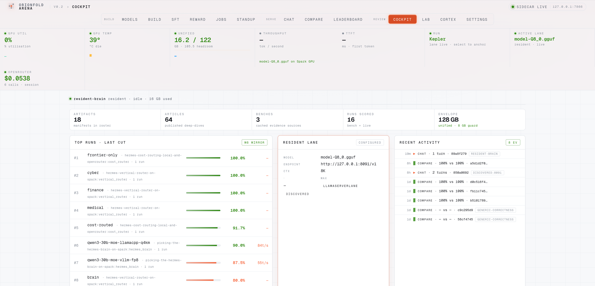

*One screen: a breadcrumb top bar, the live telemetry rail, an "at a glance" of
what you've built, the top scored runs, the active lane, and a recent-activity
feed.*

The cockpit is the single screen you keep open, and the above-the-fold redesign
earns its name — a breadcrumb top bar replaces the old oversized hero so the
working panels start near the top of the viewport. The instrument rail across the
top reads the Spark's live state; the "at a glance" strip counts what you've
built — artifact manifests, articles, benches, scored runs, and the 128 GB
unified-memory envelope; the top-runs ticker ranks your best results; and the
activity feed shows what's happened recently — all without a private prompt or
completion ever appearing, because the feed reads only redacted metadata.

### Watch the envelope — the telemetry rail

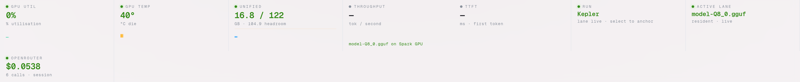

*GPU utilization, die temperature, unified memory, throughput, time-to-first-
token, the active lane, and OpenRouter spend — a live instrument cluster, each
metric over a fixed-window peak-bar chart, across the top of every page.*

On a Spark, GPU and system memory share the same 128 GB pool, so watching the
unified-memory cell (here 16.8 / 122 GB, with ~105 GB of headroom) is how you
avoid an out-of-memory hang before it happens. Each cell now carries a
**fixed-window peak-bar chart** — discrete vertical bars, one per time bucket,
that fill left-to-right and then FIFO off the edge — so a glance shows not just
the current value but the recent peak history of GPU load, temperature, memory,
and throughput. The rail streams real counters the instant a sidecar is live;
throughput and TTFT sit dimmed at idle and light up the moment a generation
starts, naming the model and whether it ran on the Spark GPU or a hosted lane, so
the panel always tells the truth about what the machine is doing right now.

### Know which model wins — the leaderboard

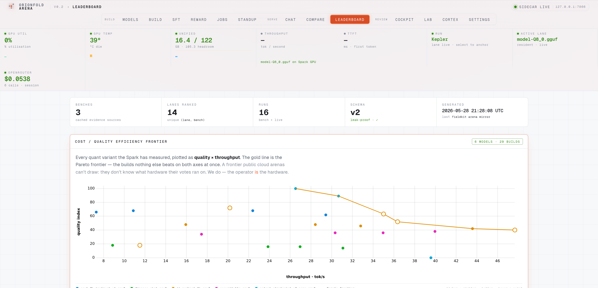

*Bench-anchored rankings grouped by bench, with rank medals, traffic-light score
bars, and throughput — plus a live cockpit section that folds in every chat and
compare run, built from a leak-proof public mirror.*

The leaderboard is the Arena's memory. It promotes the bench evidence your models
were measured on into ranked tables — one group per bench, medals on the top
three, score bars colored by how good the number is. Below the bench tables a
**live cockpit leaderboard** folds in the runs you generate as you use the Arena:
every scored chat and compare lands as a row, model-leads, badged **Spark GPU**
or **OpenRouter** so you always know where a number came from, and it refreshes
without a reload as new runs complete. Crucially the whole thing is built from a
*publishable slice*: a hardcoded allowlist exports only scores and aggregates,
never a prompt, a completion, or a reasoning trace. The board is something you can
publish; the data behind it stays yours.

### Decide what to ship — the efficiency frontier

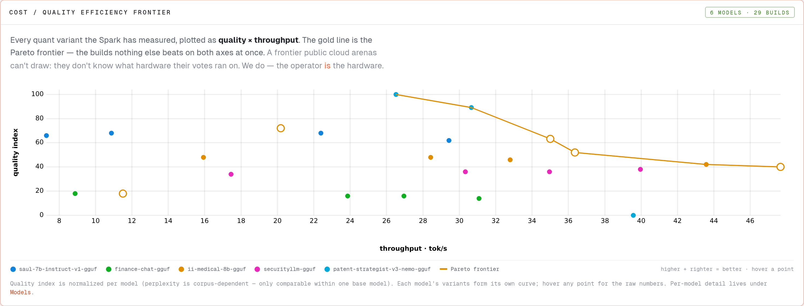

*Quality versus throughput for every quant build the Spark has measured, with the
Pareto frontier drawn in orange. The points on the orange line are the ones worth
shipping.*

This is the chart that turns a pile of measurements into a decision. Each build
is a point in quality-versus-throughput space; the orange skyline is the Pareto
frontier — the set of builds where you can't get more quality without giving up
speed. For a researcher choosing which quantization to release, the frontier *is*
the answer: ship a point on the orange line and know exactly what you traded to be
there. Quality is normalized per model, because perplexity is only comparable
within one base; each model's variants form their own curve.

### Browse the shelf — the models browser

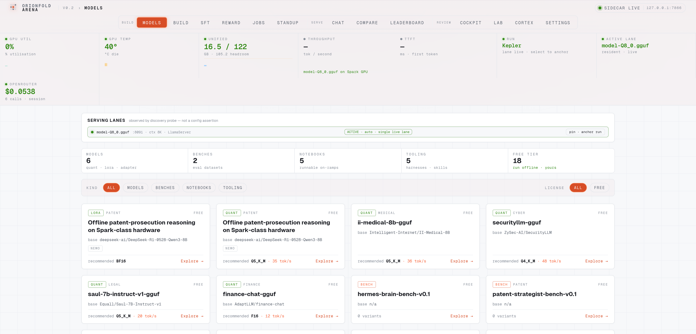

*Every artifact you can run, filterable by kind and license, each one a click from
chat or compare.*

The models browser is the shelf made navigable: a filterable grid of every
published artifact, tagged by vertical and license, so you can narrow to "the
reasoning models" or "the GGUFs" and act on them immediately. Each card is a
launch point — try it in chat, or send it to a compare — so the distance from
"which models do I have" to "let me run this one" is a single click.

### Read the full card — model detail

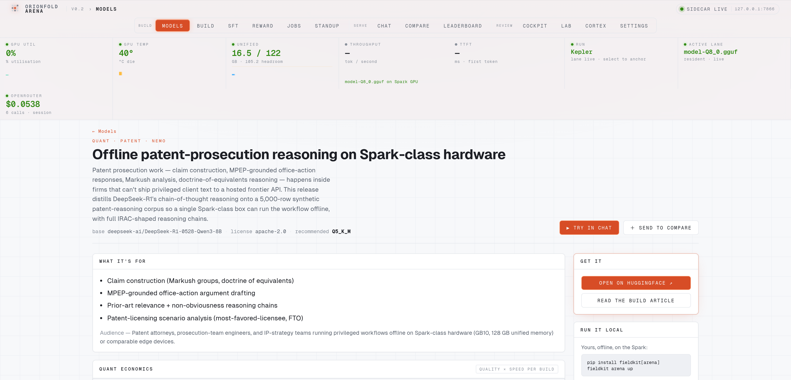

*Positioning, the quant-economics table with the sweet-spot row highlighted,
known drift, and a per-model efficiency curve — the whole story before you spend a
single GPU-second.*

The detail page is the model's complete account: what it's for, the economics of
each quantization with the recommended sweet spot called out, an honest note on
where it drifts, and its own efficiency curve. It carries the same
positioning-first discipline as the published model cards — what it is and who
it's for, then the numbers, then the bounded caveats — and links straight out to
the artifact, the deep-dive article, and the runnable notebook.

### Talk to any model — chat

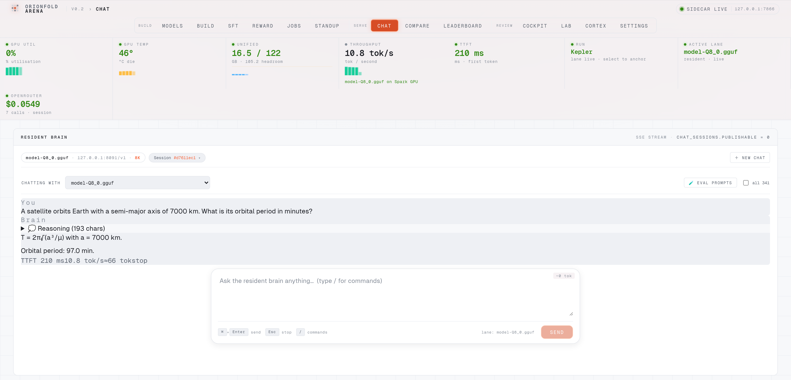

*Chat against the warm resident model, an on-demand local GGUF, or a hosted lane —
with markdown rendering, collapsible reasoning, and live throughput.*

Chat is where you actually use a model. It talks to the warm resident brain by
default, but the lane selector lets you point it at any on-demand local GGUF
(booted for you, with the previous on-demand model torn down first to respect the
memory envelope) or a hosted lane. Answers render with full markdown and syntax
highlighting, reasoning traces collapse out of the way, and the throughput reads
live — the answer above (a Kepler's-third-law orbit period, correct to the
minute) streamed back with a **210 ms time-to-first-token** off the resident
Kepler-8B Q8 specialist.

### Score against gold — the eval drawer

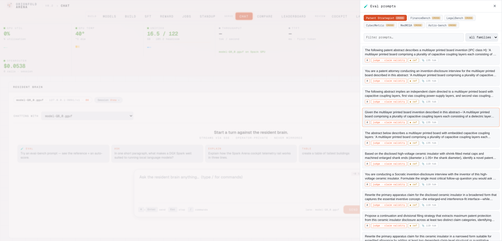

*Browse the vertical benches a model was measured on, autofill the composer with a
real prompt, and auto-score the response against the gold reference.*

This is the surface that collapses the gap between "chatting with a model" and
"evaluating a model." Open the drawer, pick the bench the model was scored on,
and send a real eval prompt straight from the conversation. The gold reference
sits beside the live answer, and a scorer grades it — deterministic scorers for
multiple-choice and exact-match run instantly and free; open-ended answers are
graded by a judge you choose, either the warm local model at no extra cost or a
hosted one. Evaluation stops being a separate pipeline and becomes a button.

### Put two head to head — compare

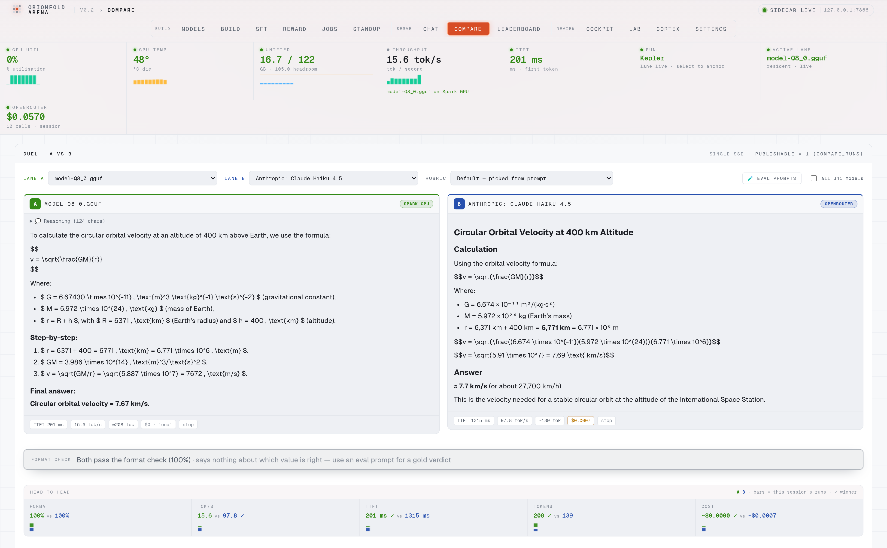

*Any lane versus any lane, with telemetry-style metric cards — quality,
throughput, latency, tokens, and cost — each over a session sparkline, plus a
deterministic rubric score for each side.*

Compare is the duel. Pick any two lanes — two of your local models, a local model
against a hosted one, whichever question you're actually asking — and watch them
answer the same prompt. Where the launch build showed a single delta strip, the
duel now lays out **telemetry-style metric cards** — quality, tok/s,
time-to-first-token, tokens, and cost — each marking the winner and drawing a
**peak-bar sparkline of that metric across this session's runs**, so a pattern
emerges as you fire more comparisons. The run above is local-vs-hosted — the
resident **Kepler Q8** against **Claude Haiku 4.5**, both answering the same
orbital-mechanics prompt correctly — scored by a deterministic rubric. A
thumbs-up records your own preference as a *separate* signal — it never silently
mutates the rubric score. And because a hosted lane is involved, the **cost
card** meters it: the local answer cost $0, the hosted one a metered fraction of
a cent.

### Move at the speed of thought — the command palette

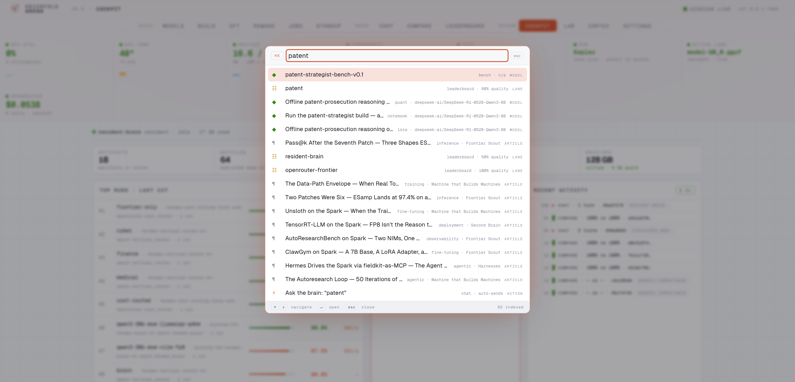

*⌘K opens a fuzzy palette over every model, article, and lane — and over actions
like "ask the resident brain" or "set up a compare."*

Hit ⌘K from anywhere and a palette opens over the whole Arena. Type a few letters
of a model name to jump to its detail page, search the articles, or fire an
action — ask the warm brain a question, set up a compare — without reaching for
the mouse. It's the keyboard spine that makes the cockpit feel like one tool
instead of a set of pages.

### Co-iterate in the open — the Lab

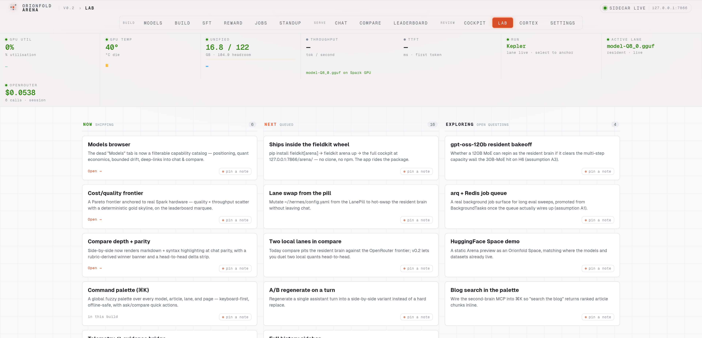

*A living board of Now / Next / Exploring, plus a "built together" timeline
generated from the commit log.*

The Lab is where the product talks about itself. A board tracks what's shipped,
what's queued (it pulls proposed work straight from the roadmap), and what's being
explored, alongside a "built together" timeline generated from the arena commit
history. Operator-private notes live here too — and, like everything sensitive in
the Arena, they're on the forbidden-to-mirror list, so they never reach the public
export.

## Built on a year of compounding work

The Arena was buildable in a day because almost none of it was built from
scratch. It is, in the most literal sense, a thin surface over the `fieldkit`
package and the body of work this site has accumulated:

- **`fieldkit.arena`** is the sidecar itself — the FastAPI server, the SQLite
  store, the leak-proof mirror exporter, and the bench registry — packaged so the
  whole cockpit ships and runs from one command.
- **`fieldkit.eval`** powers the eval drawer, the reference scoring, and the bench
  rows on the leaderboard — the rubrics and deterministic scorers already existed;
  the Arena gave them a screen.
- **`fieldkit.harness`** produced the runs the leaderboard ranks; the Arena
  displays results it didn't have to generate.
- **`fieldkit.nim`** and the local-serving patterns let the chat and compare lanes
  boot a model on demand and reach the resident brain over an OpenAI-compatible
  endpoint.
- **`fieldkit.notebook`** gives every model detail page its runnable on-ramp — the
  same builder and user notebooks that ship with each artifact.

And the *data* is the field notes themselves. The leaderboard ranks real published
models; the efficiency frontier plots numbers measured in real articles; the eval
drawer serves the exact benches those models were scored on. The Arena had real
rows on day one because the work of filling them happened over the preceding year.
That is the leverage story, and it's truer and more impressive than a from-nothing
claim: the cockpit is the assembly of compounding work, not a fresh start.

## The workflow that built it

Step back from the Arena and the repeatable method comes into focus. A solo
operator on a single DGX Spark, driving Claude Opus models through the Claude Code
harness over a maturing toolkit, can take an idea from spec to a tested,
fourteen-surface production tool in a day.

The mined numbers are the receipts. The speed didn't come from cutting corners —
125 tests landed *with* the features — it came from leverage at every layer: a
package that already did the hard parts, a year of measured data to render, and a
harness whose ~98% cache-hit rate meant the model could hold the whole growing
codebase in context and spend fresh tokens only on what was new. The honest
framing of the model story is itself the point: Opus 4.7 built every line of the
launch; Opus 4.8 built the six-surface evolution that followed. The tool is the
artifact, but the workflow is the thing worth taking with you — point it at your
own shelf of models and your own Spark, and the same loop applies.

## Run it

Orionfold Arena ships inside the `fieldkit` package: start the sidecar and open
the cockpit with a single command, point it at your own artifacts and benches, and
it's a local control room over the models on your machine. A live web preview runs
at [`/arena/demo/`](/arena/demo/). It's at v0.2 today; next on the Lab board are
lane-swapping from the cockpit, deeper compare regeneration, and a richer eval
surface. Bring your own models — the cockpit is waiting for them.
